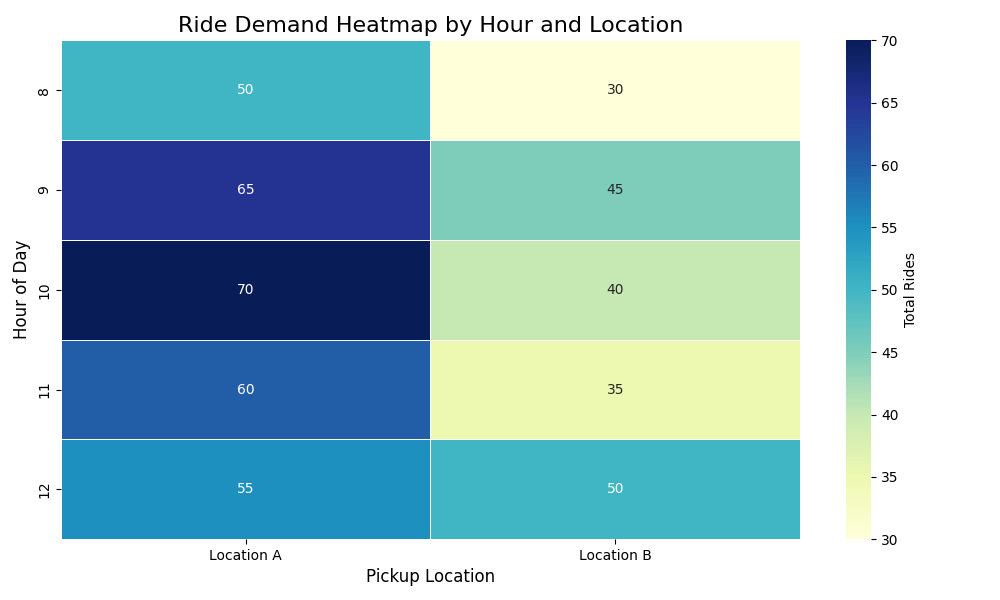

# Ride-Hailing System Documentation

## Overview
This project is a ride-hailing system designed to manage riders, drivers, vehicles, orders, rides and payments. It aims to optimize resource usage and track ride demand by location and time to improve decision-making and operations.

--- 

## Tools and Methodology

- **ER Diagram Relationship Notation**: Crow's foot
- **Visualization Tool**: Lucidchart

## Design Decisions

### 1. **Entities and Relationships**

Entities:

- Riders: Stores information about riders.
- Drivers: Stores static information about drivers.
- Vehicles: Stores static information about vehicles.
- Orders: Tracks ride requests placed by riders.
- Rides: Tracks the lifecycle of a ride linked to orders, drivers, and vehicles.
- Payments: Tracks payments made for rides.
- Active_Drivers: Tracks real-time driver status, vehicle assignment, and location for order matching.
- Rates: Stores ratings given by riders and drivers for completed rides.
- Drivers_Offers: Stores offers made by drivers for orders, tracking the status of each offer.
- Driver-Order Assignment: Records when a driver is assigned to an order after an offer is accepted.
- Credit_Cards: Manages the payment methods used by riders for processing payments.

#### **Riders, Drivers, and Vehicles**
   - **Riders**: Contains basic information about users (e.g., `FullName`, `Email`, `PhoneNumber`).
   - **Drivers**: Stores information about drivers (e.g., `FullName`, `Email`, `PhoneNumber`, `LicenseNumber`).
   - **Vehicles**: Details of vehicles available for rides (e.g., `LicensePlate`, `Make`, `Model`, `VehicleType`).

#### **Orders**
   - **Orders**: Records a rider's request for a ride, including `RiderID`, `RequestTime`, and `OrderStatus` (e.g., Pending, Accepted, Completed).

#### **Rides**
   - **Rides**: Tracks completed rides, including `RiderID`, `DriverID`, `VehicleID`, `PickupLocation`, `DropoffLocation`, `StartTime`, `EndTime`, `Distance`, `RideStatus` (e.g., In Progress, Completed), and `TotalFare`.

#### **Payments**
   - **Payments**: Stores payment records for completed rides, linking to the `Rides` table with details like `Amount`, `PaymentStatus` (e.g., Pending, Completed), and `PaymentMethod` (e.g., Credit Card, Cash).

### 2. **How the Tables Are Linked**
   - **Active Drivers and Vehicles**:
     - A bridge table, `ActiveDrivers`, tracks which drivers are available, the vehicles they are assigned to, and their current location.
   - **Order Acceptance**:
     - `AcceptedOrderSuggestions` captures when a driver accepts an order, linking `DriverID`, `VehicleID`, and `OrderID` to mark an accepted ride.
   - **Foreign Keys**:
     - Foreign keys ensure that all relationships between riders, drivers, vehicles, and payments are valid.

---

## Data Flow and Validations

### 1. **Referential Integrity**
- Each table is connected by foreign keys to maintain valid relationships. For example, rides are linked to orders, drivers, and vehicles, while payments are linked to rides.
   
### 2. **Unique Constraints**
- Certain fields, like `LicensePlate` for vehicles and `Email` for riders, are unique to prevent duplicates.

---

## Analysis and Outcomes

### 1. **Demand Analysis**:

- Demand analysis tracks ride demand by time and location, helping to identify peak periods and high-demand areas.

- This analysis aggregates ride data by date, hour, and pickup location to uncover patterns in demand across different times and locations.

- Business Value - Understanding peak demand allows for better resource allocation, ensuring sufficient drivers are available in high-demand areas, reducing wait times and improving service efficiency.

- Visualization: The results of this analysis can be effectively visualized through heatmaps, line charts, or bar charts, providing a clear and intuitive representation of demand trends.

For example:

The heatmap above illustrates ride demand over time, with intensity indicating the volume of rides per location and hour. It highlights peak demand at specific times, such as Location A around 10 AM and Location B around 12 PM, aiding in more informed driver scheduling decisions.