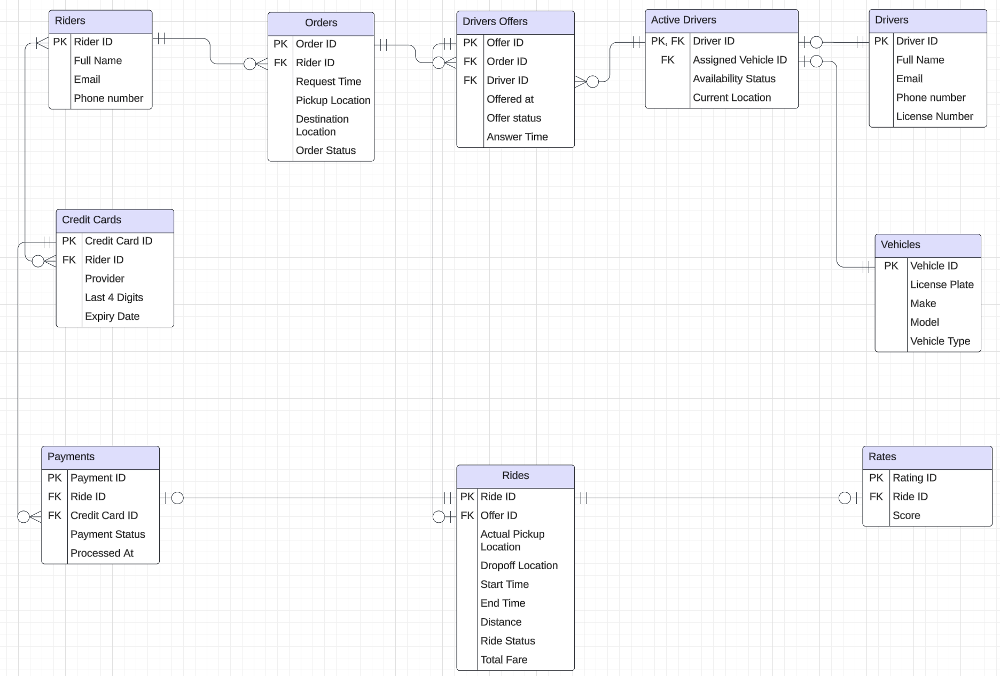

# Ride-Hailing System Documentation

## Table of Contents

1. [Design Decisions and Assumptions](https://github.com/Brit771/Data-Model-Design-Assignment/blob/main/documentation.md#design-decisions-and-assumptions)
    - [Table Structure](https://github.com/Brit771/Data-Model-Design-Assignment/blob/main/documentation.md#table-structure)
    - [Assumptions](https://github.com/Brit771/Data-Model-Design-Assignment/blob/main/documentation.md#assumptions)
    - [Relationships](https://github.com/Brit771/Data-Model-Design-Assignment/blob/main/documentation.md#relationships)
    - [Potential Limitations of Current Design](https://github.com/Brit771/Data-Model-Design-Assignment/blob/main/documentation.md#potential-limitations-of-current-design)
2. [Outcomes and Analysis](https://github.com/Brit771/Data-Model-Design-Assignment/blob/main/documentation.md#outcomes-and-analysis)

---

## Design Decisions and Assumptions

### Table Structure

1. **Drivers Table**- Stores static information about drivers such as name, contact, and licensing details.
2. **Vehicles Table**- Contains information about the vehicles registered by drivers, such as vehicle type and model. Each vehicle can be linked to only one active driver.
3. **Active Drivers Table**- Tracks dynamic data for active drivers, including the vehicle they are using. A driver enters this table once they mark themselves as active.
4. **Riders Table**- Stores information about passengers who create accounts and want to be able to request rides.
5. **Orders Table**- Stores ride requests made by riders, which are later sent as offers to active drivers.
6. **Drivers Offers Table**- Stores the rides order offers that has been sent to the active drivers.
7. **Rides Table**- Records all rides information like  pickup location, ride status, total fare etc. The table is linked to one accepted order offer.
8. **Payments Table**- Stores payment information related to completed rides. Payments can only be made via credit card.
9. **Credit Cards Table**- Contains credit card details of users, which are used for payment processing.
10. **Rates**- In the end of the ride, the rider can rate the ride that can be linked to the driver eventually.

### Assumptions

- Driver Offers: Offers are only sent to active drivers.
- Vehicle Assignment: A vehicle can only be assigned to one active driver at a time.
- Payment: Customers can only pay with a credit card in a single payment upon ride completion.
- Driver Location: The driver's location is sampled and updated at regular intervals and at the end of a ride.
- Driver Selection: A prioritization algorithm selects the driver based on time of arrival, response speed, and driver rating. So even though many drivers can approve a offer for a particular order, only one will be selected and linked to the actual ride.
- Fare Calculation: The total fare and distance are calculated when the ride ends.
- Location field foramt: Area/Zone, Street Name, City, Postal Code

### Relationships

- **Drivers ↔ Active Drivers**-
    - 1-to-1: A driver may appear in the Active_Drivers table once, or not at all.
    - 1-to-1: A vehicle may be assigned to one active driver, or none.
- **Active Drivers ↔ Driver Offers**-
    - 1-to-many: An active driver can receive multiple offers or none.
    - 1-to-1: Each offer is associated with one active driver.
- **Driver Offers ↔ Orders**-
    - many-to-1: Multiple offers can be linked to the same order.
    - 1-to-1: Each offer is tied to one specific order.
- **Driver Offers ↔ Rides**-
    - 1-to-1 : An offer may result in one ride if accepted, or none.
    - 1-to-1: Each ride corresponds to one accepted offer and order.
- **Rides ↔ Payments**-
    - 1-to-1 : A ride may have one payment, or none if unpaid.
    - 1-to-1: Each payment is linked to a single ride.
- **Payments ↔ Credit Cards**-
    - many-to-1: Multiple payments can be processed by the same credit card.
    - 1-to-1: Each payment is tied to one credit card.
- **Credit Cards ↔ Riders**-
    - 1-to-many: A rider can own none or multiple credit cards.
    - 1-to-many: Each credit card belongs to a few rider.
- **Riders ↔ Orders**-
    - 1-to-many: A rider can place multiple orders or none.
    - 1-to-1: Each order is associated with one rider.

### Potential Limitations of Current Design

Here are a few limitations of the current design and solutions suggestions to address them:

| **Subject**                   | **Limitation**                                                                                      | **Solution**                                                                                             |
|-------------------------------|------------------------------------------------------------------------------------------------------|----------------------------------------------------------------------------------------------------------|
| **Driver Activation History** | No record of when drivers activate/deactivate, losing history for analysis.                        | We can Use an `Activation_History` table to log each activation/deactivation event and vehicle assignments with timestamps.             |
| **Driver Location**           | `CurrentLocation` in `Active_Drivers` doesn’t track historical movements or ensure real-time updates. | We can Add a `Driver_Location_History` table to store GPS updates with timestamps.                              |
| **Future Enhancements**       | Lacks support for features like scheduled trips or driver shift tracking.                          | We can include modular tables like `Scheduled_Trips` or `Shifts` for extensibility.

---

## Outcomes and Analysis

### 1. **Demand Analysis**

- Demand analysis tracks ride demand by time and location, helping to identify peak periods and high-demand areas.

- This analysis aggregates ride data by hour, and pickup location to uncover patterns in demand across different times and locations.

- Business Value - Understanding peak demand allows for better resource allocation, ensuring sufficient drivers are available in high-demand areas, reducing wait times and improving service efficiency.

- Visualization: The results of this analysis can be effectively visualized through heatmaps, line charts, or bar charts, providing a clear and intuitive representation of demand trends.

For example:

The heatmap above illustrates ride demand over time, with intensity indicating the volume of rides per location and hour. It highlights peak demand at specific times, such as Location A around 10 AM and Location B around 12 PM, aiding in more informed driver scheduling decisions.